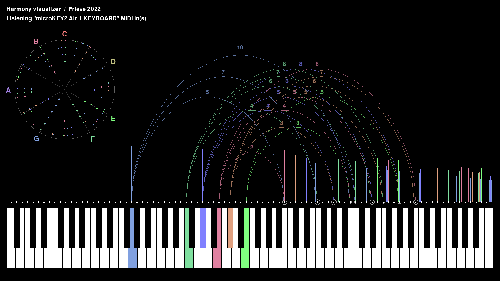

# Harmony Visualizer
A tool for visualizing the harmony of MIDI input.

(英語に続き日本語の解説があります)

A tool for visualizing the harmony of the sound using virtual overtones based on MIDI input.

 

## How to download and install on Windows

Latest version for 64bit Windows can be downloaded from the following page.

https://github.com/Frieve-A/harmony_visualizer/releases

Unzip the downloaded zip file and run the harmony_visualizer.exe to launch the app. No installation is required.

 

## How to execute on other platforms

This application is written in Python.
Follow the steps below to execute the Python code of the Harmony Visualizer.

1. git clone https://github.com/Frieve-A/harmony_visualizer.git
2. pip install -r requirements.txt
3. python harmony_visualizer.py

 

## How to use

If a MIDI keyboard is available, connect the MIDI keyboard to your PC and launch the app.

When you play a note with the MIDI keyboard or click on the keyboard, the notes you play are displayed in different colors on the keyboard for each note name. For example, Do is displayed in red, and So is displayed in blue which is a little closer to green.

Above the keyboard display, a vertical line is displayed to indicate the volumme of the virtual overtones. For example, if you play Do, a vertical line indicating the second overtone is displayed at the Do position one octave higher, and the third overtone is displayed at the So position.

If you input two or more sounds at the same time and the overtones are in harmony with each other, the overtones that are in harmony with the input sound are connected by a curve. The numbers on the curve indicate which overtones are in harmony.

The graph on the upper left shows the volume of each overtone as a polar coordinate graph with a radius as a pitch and an angle that makes one round in one octave.

To hold the display, press the CTRL key on your computer keyboard or press the damper pedal on your MIDI keyboard.

Play your favorite songs and visually enjoy the harmony of the overtones!

 

## Keyboard shortcuts

ESC : Exit the app

F11 : Switch to full screen

 

---

 

MIDI入力を元にした仮想的な倍音を用いながら、音のハーモニーを可視化するツールです。

 

## ダウンロードとインストール（Windows）

以下のページより64bit Windows用の最新バージョンをダウンロードします。

https://github.com/Frieve-A/harmony_visualizer/releases

ダウンロードしたzipファイルを解凍し、harmony_visualizer.exeファイル起動します。インストールは不要です。

 

## その他のプラットフォームで実行するには

本アプリケーションはPythonで作成されています。
以下の手順でHarmony VisualizerのPythonコードを実行します。

1. git clone https://github.com/Frieve-A/harmony_visualizer.git
2. pip install -r requirements.txt
3. python harmony_visualizer.py

 

## 使い方

MIDIキーボードが利用できる場合、PCにMIDIキーボードを接続してアプリを起動します。

MIDIキーボードで音を弾くか、鍵盤上をクリックすると、弾いた音は音名毎にそれぞれ異なる色で鍵盤上に色分け表示されます。例えばドは赤色で、ソは少しグリーン寄りの青で表示されます。

鍵盤表示の上には、仮想的な倍音の大きさを示す縦線が表示されます。例えばドを弾いた場合、1オクターブ上のドの位置に2倍音、ソの位置に3倍音を示す縦線が表示されます。

2つ以上のを同時に入力しその倍音同士が調和している場合、入力した音と調和している倍音は曲線で結ばれます。曲線の上の数字は調和しているのが何番目の倍音であるかを示しています。

左上のグラフはそれぞれの倍音の強度を、半径を音程とし、角度を1オクターブで1周するように設定した極座標グラフで表示したものです。

表示をホールドするには、パソコンのキーボードのCTRLキーを押すか、MIDIキーボードのダンパーペダルを踏みます。

好きな楽曲を演奏し、倍音同士が調和する様子を視覚的に楽しみましょう！

## キーボードショートカット

ESC : アプリを終了

F11 : フルスクリーンへの切り替え

